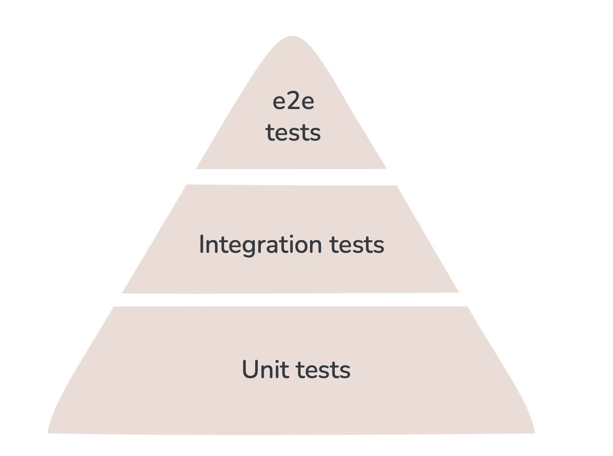

Out of all the things that transformed the digital landscape last year, one of my favorites is the inspiring way that professionals with no coding skills have delivered new indie software solving real-world problems. My ex-coworker [Lucie Papelier](https://www.linkedin.com/in/luciepapelier/)  built [Threadologie](https://apps.apple.com/at/app/threadologie-bead-pattern/id6755602806?l=en-GB), an app that generates beading patterns from photos and speeds up the beading process with interactive progress tracking. A few weeks back I talked at [Product Discovery & Delivery meetup](www.meetup.com/product-discovery-delivery-vienna/events/313064625), where we also listened to [Christoph Bodenstein](https://www.linkedin.com/in/christophbodenstein/)'s story about developing [_DocReady_](https://www.linkedin.com/company/docready-at/posts/?feedView=all), an app that saves independent doctors in Austria many sleepless nights of admin paperwork. On projects like this, it's important to keep momentum, but a few important obstacles might "damage" the pace.

When discussing these new powers, people like to say that the new bottleneck in development is the task of coming up with new features, but there's a bigger one, less discussed, and I've also confirmed my hunch in personal conversations.

LLMs being inherently prone to error, reliability is an issue. Although little involvement is needed while the agent is [Perambulating](https://github.com/wynandw87/claude-code-spinner-verbs) or whatever, making sure that 1 - your feature is correctly implemented, and 2 - nothing else has been broken - might take orders of magnitude longer time. And the checks need to be redone after each failed attempt. If you don't redo the checks, you will learn to understand how much harder it is to debug an issue if you don't know when it appeared. In any case, preventing unintended behavior changes of the system *will* be one of the first blocks that non-engineers utilizing autonomous agents will encounter, and feelings of fragility may slow the momentum. 

A lot of people say refactoring vibe-coded apps will be a sort of job security for software engineers, but, first of all, no thanks, and second, there are a few things you can learn to stretch the agents further before adding a financial burden of recruiting someone to your project. 

## You can actually have an interface for tests
Of course, here is where the (automated) tests come in, and I'll give it to them, our little hallucination machines rarely forget to include it in their planning. However, the tests they deliver have the same likelihood of being total nonsense as the rest of the code, even if you ask them to not make mistakes btw, and that's not all. The tests that they *do* deliver correctly are *awful* tests that I strongly dislike. 

Before I explain how a test can be awful, well first need to understand an important concept in Software Engineering. Even without being involved with the code, you can use that knowledge to improve your understanding of the project, and ask your agent to deploy the tools that even expose system tests via UI.

For the purpose of keeping the guide accessible and demonstrative, I will focus my examples purely on front-end.

## The testing Pyramid

A Software System will need _many_, _many_ tests, but they're not all created equal. If you understand how to categorize the tests, you will isolate the subsets where you can be involved. 

### Unit tests
Think of a unit as a component or very small collection of components. There is no single definition of a unit, but let's take for example a password input field during registration. There is nothing that should be tested in the ui for this, this is functionality only - specific instances of text should be valid, while others should be invalid.

Now, you only need to check the ui to see how the *disabled* button *looks* when the text is invalid. The tests will make sure that button stays disabled even as your component is updated in the future

### Integration tests
When you are combining these fields into a registration *form*, you should only test single valid/invalid configurations for each fields, not all possible configurations for all fields. For example, when testing whether the submit button should be disabled or not, the test should only cover the scenario of a valid password, and one other scenario of single example of an invalid password. The rest is covered in the unit test.
### End-to-end (e2e) tests
E2e tests typically focus on user scenarios and flow. They make sure that application as a whole makes sense. For a web app, you would use a tool like [playwright](https://playwright.dev/) to navigate to the website and perform actions that use would - type this, click here, such-and-such element should appear.

### Moving along the pyramid
Unit tests are fast, isolated, straightforward - i.e, cheaper in many ways, meaning you can have a large number of them. This is why they make up the *base layer*, and if you need to test something, try to have it there. As you move higher along the pyramid, be more considerate about number of scenarios. At e2e level, you should ideally be matching the tests to your user story scenarios.

## How can tests be terrible
Adding tests is not always a net positive. There are a few problems that impact test quality
### Granularity
tests that are too granular create overhead for future changes. When they are too coupled with implementation, each small change in the code requires as many (or sometimes, more!) updates to the tests. This makes updates burdensome and increases cognitive load to make sure the checks get rewritten properly.

### Implementation Coupling 
Implementation coupling can create even bigger issues. More often than not, tests are written once functionality is implemented, and it's not rare to see test cases where a function is checked line by line. It's almost a tautology - "make sure the code is written the way it is written". Important domain logic might get completely overlooked in this process, setting up future changes to get falsely flagged as "good to go".

Large language models are not immune to these faults. It makes sense, because  the models are as good as the data they're trained on, and good tests are more rare than good code. 

## How to improve bad tests
### Don't use functional tests to check how things *look*
You shouldn't need to make 14 clicks to trigger an error and check whether the paragraph is split evenly. Tools like storybook enable you to preview isolated components, and even render different possible states side by side. I'm more of a "back-end" Full Stack dev but this tool completely changed how I approach (and enjoy) frontend development, and if you will take away only one thing from here, it should be this one.

### Think beyond test coverage
Test coverage tools measure which lines of code are actually executed when running each test, and the idea is that test suite should cover. If no tests check a specific section of code, then not all functionality is covered. This makes test coverage an important metric, but centering test design around it can lead to some pitfalls that I mentioned earlier. This is why I mostly use test coverage tools to understand the gaps, and instead of adding one more test right away that checks those lines only, I first try to see if existing scenarios can be improved to include it.

### Decouple definition from implementation
Even though as a non-programmer, you're limited in your ability to direct or review the code that will be written to execute the tests, you can participate in designing them. Refine your user stories to include specific user actions - if you have trouble connecting them, use playwright's [code generation](https://playwright.dev/docs/codegen) tool.

Participate in the conceptualizing. Unit and integration tests require some level of system thinking, but it's very rewarding to develop that skill. Start thinking of the system in modules and layers, and you will find it easier to describe.

### Set up replay tools
You still have to make sure that the implemented tests make sense. [Playwright](https://playwright.dev/) allows you to record the whole session with [traces](https://playwright.dev/docs/trace-viewer-intro) - video, timestamped console and network logs. I would go as far as advising to put playwright at the **center** of your development. When an agent finishes implementing something, instead of opening the application and clicking around, you can review the interaction footage from the tests. I'm working on a talk where I will elaborate better on what that means, if you're a meetup/conference host and think your audience will be interested, ping me on LinkedIn or via email.

## Next steps
Mainstream approaches/tooling in agentic AI ecosystem are not yet structured enough to support mature frameworks like this out-of-the box, but hopefully the concepts explained here will help you make meaningful adjustments to improve your workflow. Here's a few places where you can start:

- set up the tools and familiarize yourself with their UI and options
- start slowly extending the tests for existing features
- practice Test-Driven-Development - before asking the agent to implement something, think about how your feature would translate to **series of actions** from the user and **expected behavior** of the system. Same for when you find a bug

I'd love to hear your thoughts. If you find the post helpful or have follow-up questions, don't hesitate to reach out on your preferred channel <3